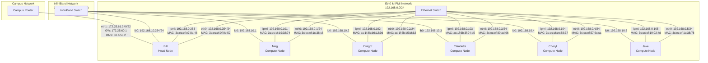

```mermaid
graph BT
  %% --- 機器ノード ---
  Bill[Bill<br/>Head Node]
  Meg[Meg<br/>Compute Node]
  Dwight[Dwight<br/>Compute Node]
  Claudette[Claudette<br/>Compute Node]
  Cheryl[Cheryl<br/>Compute Node]
  Jake[Jake<br/>Compute Node]

  ClusterSW[Ethernet Switch]
  IBSW[InfiniBand Switch]
  CampusRTR[Campus Router]

  %% --- ネットワークセグメントの定義 ---
  subgraph "Eth0 & IPMI Network\n192.168.0.0/24"
    direction TB
    ClusterSW
    Bill
    Meg
    Dwight
    Claudette
    Cheryl
    Jake
  end

  subgraph "InfiniBand Network\n192.168.10.0/24 (OpenSM)"
    direction TB
    IBSW
    Bill
    Meg
    Dwight
    Claudette
    Cheryl
    Jake
  end

  subgraph "Campus Network\n172.25.60.0/22"
    direction TB
    CampusRTR
    Bill
  end

  %% --- 無向リンク & ラベル ---
  Bill     ---|eth0: 192.168.0.254/24<br/>MAC: 3c:ec:ef:0f:0e:52| ClusterSW
  Meg      ---|eth0: 192.168.0.1/24<br/>MAC: 3c:ec:ef:1c:38:c6| ClusterSW
  Dwight   ---|eth0: 192.168.0.2/24<br/>MAC: ac:1f:6b:b5:bf:62| ClusterSW
  Claudette---|eth0: 192.168.0.3/24<br/>MAC: 3c:ec:ef:80:ad:96| ClusterSW
  Cheryl   ---|eth0: 192.168.0.4/24<br/>MAC: 3c:ec:ef:57:6c:ca| ClusterSW
  Jake     ---|eth0: 192.168.0.5/24<br/>MAC: 3c:ec:ef:1c:38:78| ClusterSW

  Bill     ---|ipmi: 192.168.0.253<br/>MAC: 3c:ec:ef:e7:8a:46| ClusterSW
  Meg      ---|ipmi: 192.168.0.101<br/>MAC: 3c:ec:ef:19:02:74| ClusterSW
  Dwight   ---|ipmi: 192.168.0.102<br/>MAC: ac:1f:6b:b9:12:9d| ClusterSW
  Claudette---|ipmi: 192.168.0.103<br/>MAC: ac:1f:6b:3f:94:b5| ClusterSW
  Cheryl   ---|ipmi: 192.168.0.104<br/>MAC: 3c:ec:ef:ee:88:37| ClusterSW
  Jake     ---|ipmi: 192.168.0.105<br/>MAC: 3c:ec:ef:19:02:4d| ClusterSW

  Bill     ---|ib0:  192.168.10.254/24| IBSW
  Meg      ---|ib0:  192.168.10.1      | IBSW
  Dwight   ---|ib0:  192.168.10.2      | IBSW
  Claudette---|ib0:  192.168.10.3      | IBSW
  Cheryl   ---|ib0:  192.168.10.4      | IBSW
  Jake     ---|ib0:  192.168.10.5      | IBSW

  Bill     ---|eth1: 172.25.61.249/22<br/>GW: 172.25.60.1<br/>DNS: 50.4/50.2| CampusRTR

```