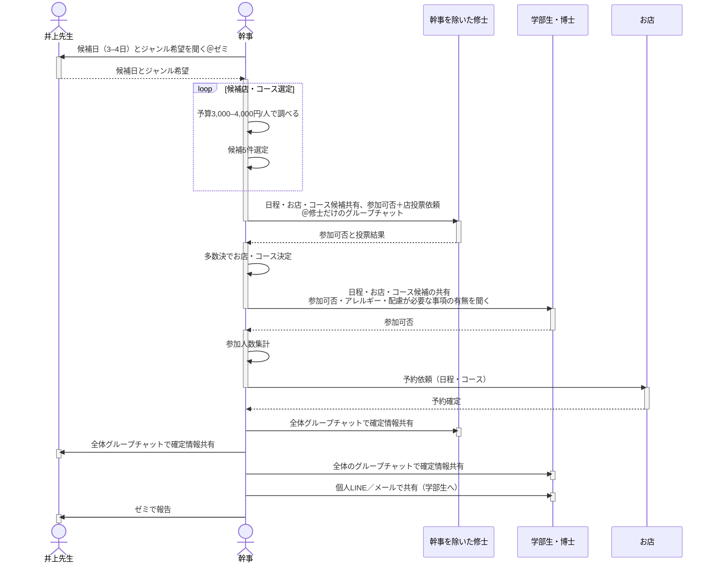

<h1>01_Party</h1>
    <h2>概要</h2>
    幹事を任された責任感の強い君の時間が、少しでも増えますように。
    <h2>0. 目次</h2>
        <ol>
            <li><a href=#freq>開催頻度</a></li>
            <li><a href=#flow>フロー</a></li>
        </ol>
    <h2 id=freq>1. 開催頻度</h2>
    年度に 3 回。ここでは幹事が企画する順で記す。
        <ol>
            <li>
                新歓
                <ul>
                    <li>時期：4 月中（始業式以後）</li>
                    <li>参加者：井上先生、（博士、）新M2、新M1（、新B4）</li>
                </ul>
            </li>
            <li>暑気払い
                <ul>
                    <li>時期：8 月中（if 推薦入試受験者>0; 推薦入試合格発表以降）</li>
                    <li>参加者：井上先生、（博士、）M2、M1、院試受かった B4</li>
                </ul>
            </li>
            <li>年度末飲み会
                <ul>
                    <li>時期：2 月末～ 3 月中旬（修論公聴会以後）</li>
                    <li>参加者：井上先生、（博士、）M2、M1、院試受かった B4</li>
                </ul>
            </li>
        </ol>

<h2 id=flow>2. フロー</h2>
幹事を行う際の基本フローを下記に `Mermaid記法` の状態遷移図で示す。

<h3>井上研だけで開催する場合</h3>

## 3. お店の条件

1. 【必須】座敷 or 掘りごたつ
    - 井上先生の腰が痛くならないような席が好ましい。
    - (できれば)全員の集合写真が撮りやすいような席があるお店が良い。
2. 【必須】(食べ)飲み放題コース
    - 時間や金額が決まっている方が良い。
    - 予算は 3,000–4,000円/人 程度。
3. 【推奨】禁煙
    - 井上先生は非喫煙者。

## A1. 過去開催履歴

2023 年度の暑気払い以降の履歴を示す。

| 開催日         | 開催時刻     | ジャンル     | 場所                                    | 社会人/博士                          | M2                | M1                        | B4                | 参加者数 | 開催種類   | コース                                                                                   | 備考 |
| -------------- | ------------ | ------------ | --------------------------------------- | ------------------------------------ | ----------------- | ------------------------- | ----------------- | -------- | ---------- | ---------------------------------------------------------------------------------------- | ---- |
| 2024-03-08 (Fri.) | 18:00-20:00 | しゃぶしゃぶ | 椿屋 神戸三宮店                         | 井上先生、Benjamin、西さん            | 玉置さん、早川さん        | 池田さん                     | 辛嶋、福井        | 8        | 年度末飲み会 | https://tubakiya-koubesannomiya.owst.jp/courses/174983193                                |      |
| 2024-04-05 (Fri.) | 18:30-20:30 | 焼肉         | ふうふう亭                              | 井上先生、Benjamin、西さん、新井さん  | 池田さん、早川さん | 大塚、ジュンくん、福井、辛嶋 |                   | 9        | 新歓       | https://fufutei-44.owst.jp/courses/173289074                                             |      |
| 2024-08-02 (Fri.) | 18:30-20:30 | 居酒屋       | 魚 駅前 サンキタ総本店                  | 井上先生                              | 池田さん          | 大塚、ジュンくん、福井、辛嶋 | 伊藤くん、奥野くん | 8        | 暑気払い   | https://www.hotpepper.jp/strJ001227395/course_cnod09/                                    |      |
| 2025-02-21 (Fri.) | 19:00-21:00 | 居酒屋       | 海鮮居酒屋　三ノ宮産直市場　生田ロード本店 | 井上先生                              | 池田さん          | ジュンくん、福井、辛嶋     | 伊藤くん、奥野くん        | 7        | 年度末飲み会 | https://www.hotpepper.jp/strJ000960957/course_cnod01/                                    |      |
| 2025-04-09 (Wed.) | 18:30-20:30 | 焼肉         | 新こだわり亭 三宮店                     | 井上先生、竹村先生、新井さん、山下さん                              | 大塚、ジュンくん、福井、辛嶋 角田、門野、中谷、原田、松本、横谷さん          | 伊藤くん、奥野くん 角野さん、林くん、松川さん | --        | 8+9        | (竹村研との合同)新歓       | https://www.hotpepper.jp/strJ000063193/course_cnod16/                                    |      |

## A2. お店 DB

| 店名 | 場所 | ジャンル | 席数 | 価格帯 | URL |
| :--- | :--- | :--- | :--- | :--- | :--- |
| [刺身・おでん・串カツ 高架下酒場あし跡 三宮店](https://www.hotpepper.jp/strJ001215887/?vos=nhppalsa000016) | 神戸 | 居酒屋 | 88席 | 2001～3000円 | https://www.hotpepper.jp/strJ001215887/?vos=nhppalsa000016 |
| [ワインと低温調理肉のビストロ CUReHA 神戸三宮](https://www.hotpepper.jp/strJ000768636/?vos=nhppalsa000016) | 神戸 | イタリアン・フレンチ | 73席 | 3001～4000円 | https://www.hotpepper.jp/strJ000768636/?vos=nhppalsa000016 |
| [旨唐揚げと居酒メシ 居酒屋 ミライザカ 三宮店](https://www.hotpepper.jp/strJ001161436/?vos=nhppalsa000016) | 神戸 | 居酒屋 | 144席 | 2001～3000円 | [https://www.hotpepper.jp/strJ001161436/?vos=nhppalsa000016](https://www.hotpepper.jp/strJ001161436/?vos=nhppalsa000016) |
| [魚貝・鶏料理・日本酒 とよ新](https://www.hotpepper.jp/strJ001217041/?vos=nhppalsa000016) | 神戸 | 居酒屋 | 64席 | 3001～4000円 | https://www.hotpepper.jp/strJ001217041/?vos=nhppalsa000016 |
| [兵庫県連携協定店 ひょうご五国ワールド 神戸三宮横丁](https://www.hotpepper.jp/strJ001223589/?vos=nhppalsa000016) | 神戸 | 居酒屋 | 160席 | 2001～3000円 | [https://www.hotpepper.jp/strJ001223589/?vos=nhppalsa000016](https://www.hotpepper.jp/strJ001223589/?vos=nhppalsa000016) |
| [魚 駅前 サンキタ総本店 (さかな えきまえ)](https://www.hotpepper.jp/strJ001227395/?vos=nhppalsa000016) | 神戸 | 居酒屋 | 80席 | 2001～3000円 | [https://www.hotpepper.jp/strJ001227395/?vos=nhppalsa000016](https://www.hotpepper.jp/strJ001227395/?vos=nhppalsa000016) |
| [完全個室 焼肉食べ放題 牛牛 ぎゅうぎゅう ☆彡パラダイス 三宮](https://www.hotpepper.jp/strJ003298698/?vos=nhppalsa000016) | 神戸 | 焼肉・ホルモン | 48席 | 3001～4000円 | [https://www.hotpepper.jp/strJ003298698/?vos=nhppalsa000016](https://www.hotpepper.jp/strJ003298698/?vos=nhppalsa000016) |
| [海鮮 寿司 焼き鳥 肉 もつ鍋 食べ飲み放題 完全個室居酒屋 あきみつ 三宮本店](https://www.hotpepper.jp/strJ003532301/?vos=nhppalsa000016) | 神戸 | 居酒屋 | 120席 | 2001～3000円 | https://www.hotpepper.jp/strJ003532301/?vos=nhppalsa000016 |
| [サムギョプサル×食べ飲み放題×個室貸切宴会 韓国居酒屋 Eng 炎 神戸三宮本店](https://www.hotpepper.jp/strJ000023138/?vos=nhppalsa000016) | 神戸 | 韓国料理 | 34席 | 3001～4000円 | [https://www.hotpepper.jp/strJ000023138/?vos=nhppalsa000016](https://www.hotpepper.jp/strJ000023138/?vos=nhppalsa000016) |
| [九州料理&和牛もつ鍋×完全個室 居酒屋 蔵～ＫＵＲＡ～](https://www.hotpepper.jp/strJ001203660/?vos=nhppalsa000016) | 神戸 | 居酒屋 | 200席 | 2001～3000円 | [https://www.hotpepper.jp/strJ001203660/?vos=nhppalsa000016](https://www.hotpepper.jp/strJ001203660/?vos=nhppalsa000016) |
| [全席完全個室居酒屋 博多焼き鳥 野菜巻き 和ノ音 神戸三宮駅前店](https://www.hotpepper.jp/strJ003649317/?vos=nhppalsa000016) | 神戸 | 居酒屋 | 204席 | 2001～3000円 | [https://www.hotpepper.jp/strJ003649317/?vos=nhppalsa000016](https://www.hotpepper.jp/strJ003649317/?vos=nhppalsa000016) |

## A3. メッセージのテンプレ

    
お店の候補を井上先生に共有する

    <blockquote>
    ■2/21(金) お食事会に関するご共有■ 
    下記の要領で考えております。いかがでしょうか。 
    お店：海鮮居酒屋　三ノ宮産直市場　生田ロード本店 
    アクセス：https://maps.app.goo.gl/kFY54RyMJWGbZ6xT9 
    お席：禁煙、お座敷 
    コース：https://www.hotpepper.jp/strJ000960957/course_cnod01/ 
    コース料金：4,000円/人
    </blockquote>

    
決定事項の共有・前日リマインド

    <blockquote>
    竹村研との合同新入生歓迎会についての前日リマインドとなります。 
    【4/9(水) 18:30-20:30 竹村研との合同新歓】 
    - 日時： 4/9(水) 18:30～20:30 
    - 集合場所：三宮コスモビル前 
    - お店： 新こだわり亭 三宮店(焼肉) 
    - アクセス： https://maps.app.goo.gl/PaPwSV1FjbeySrbD6 
    - 参加者（計19名）：竹村先生、井上先生、以下学生詳細 
      - 竹村研：Dr. 1名、M2 6名、M1 3名 
      -井上研：Dr. 1名、M2 4名、M1 2名 
    - お席：禁煙、お座敷 
    - コース： 食べ飲み放題　4,000円/人　(https://www.hotpepper.jp/strJ000063193/course_cnod16/) 
    </blockquote>

    
博士の方に参加の可否・アレルギーの有無を伺う（メール版）

    <blockquote>
    突然のご連絡失礼します。 
    兵庫県立大学井上研究室 学部4年生（4月から修士1年）の辛嶋凜太郎と申します。 
    これからよろしくお願いします。 
    実はこの度井上先生より新入生歓迎会の幹事を任されておりまして、 
    新井さんにもぜひご参加いただきたく、ご連絡させていただきました。 
    （ご連絡先は井上先生よりいただきました。） 
    現時点で、下記のような【開催概要】を考えております。 
    つきましては 
    4/1(月)～4/5(金)　各日18:00～20:00　でご都合のよろしいお日にち 
    食物等アレルギー、好みでない食べ物の有無 
    の2点について、ご教示いただけますと幸いです。 
    よろしくお願いします。 
    またその他ご質問等ございましたら、ご遠慮なくご連絡お願いいたします。 
    【開催概要（3/12時点）】 
    - 参加者：井上先生、西さん（エンジニア）、Benjaminさん（ドイツ人ポスドク）、早川さん（M2）、池田さん（新M2）、ジュンくん（韓国人新M1）、大塚くん（新M1）、福井さん（新M1）、辛嶋 
    - 日時：未定、18:00～20:00 
    - 第1候補：4/5(金) 
    - その他候補：4/1(月)～4/4(木) 
    - 参加費：4,500～5,000円 
    - お店：未定（三宮駅付近） 
    </blockquote>

    
博士の方に詳細を共有する（メール版）

    <blockquote>
    辛嶋です。本日もお疲れ様です。 
    新歓の詳細が決まりましたので、下記の通りお知らせいたします。 
    ご不明点、ご懸念点等ございましたら、ご遠慮なく辛嶋までお申し付けください。 
    よろしくお願いします。 
    【詳細】 
    - 日時：4/5(金) 18:00～20:00 
    - 店名：ふうふう亭　三宮店（焼肉居酒屋、https://fufutei-44.owst.jp ） 
    当日は、5分前を目安にお店のあるビルの前に集合→入店の要領でお願いします！  
    - 場所：ファンタジービル3F（https://maps.app.goo.gl/PPRvoUr56H9kZJeH9 ） 
    - コースメニュー：焼肉食べ放題93品+プレミアム飲み放題55種（https://fufutei-44.owst.jp/courses/173289074 ） 
    - 席：掘りごたつ式 
    - 参加者（10名）：井上先生、西さん（エンジニア）、新井さん、 Benjamin（ポスドクfromドイツ）、 早川さん（M2）、池田さん（新M2）、大塚くん（新M1）、ジュンくん（新M1 from韓国）、福井さん（新M1）、辛嶋（新M1） 
    - 予算：5,148円/人 
    </blockquote>

